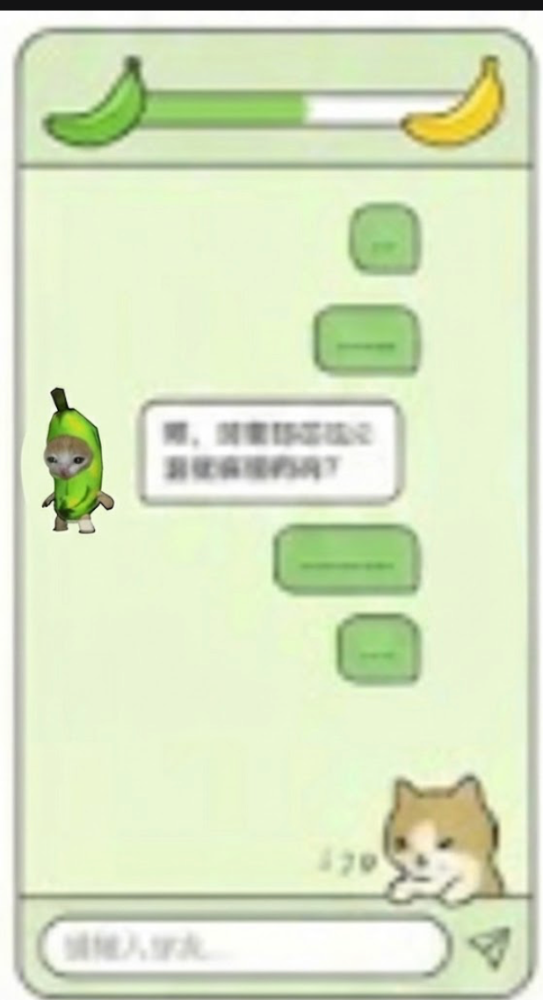

# VISION GUIDE (蕉个猫绿 GreenBanana)

## 1. 核心理念 (Core Concept)

**"蕉个猫绿"** (谐音“交个朋友”与“焦虑”) 是一个旨在帮助年轻人缓解焦虑的互动小程序。

*   **隐喻体系**:
    *   **绿色香蕉猫**: 代表用户（或初始状态的 AI），处于青涩、焦虑、未成熟的状态。
    *   **黄色香蕉猫**: 代表成熟、释怀、快乐的状态。
    *   **对话过程**: 是一个“催熟”的过程。随着对话的深入，绿色香蕉猫逐渐变黄，象征着焦虑的缓解和心结的打开。
*   **互动风格**: 轻松、治愈、Gamification (游戏化)、Meme (梗文化)。

---

## 2. 视觉风格 (Visual Style)

*   **色调**:
    *   **主色**: **奶绿色** (`#F0FFF0` 或类似柔和的浅绿)，代表放松和安全感。
    *   **强调色**: **明黄色** (`#FFEB3B` 香蕉黄)，代表快乐和能量。
    *   **辅助色**: **深绿色** (用于文字或图标轮廓)，**橙色** (用于警告或强调)。
*   **材质**:
    *   **扁平化 + 微质感**: 主要是扁平插画风格，但卡片和猫可以有轻微的阴影或纸质感。
    *   **去工业化**: 相比之前的“心情实验室”机械风格，新版更偏向“自然”、“手绘”或“剧场”风格。

---

## 3. 页面设计 (Page Design)

### 3.1 主页 (Home Page) - "选个猫聊"

**概念**: 用户进入小程序，看到三只性格各异的绿色香蕉猫。

*   **布局**:
    *   **Header**: 大标题 **"蕉个猫绿"** (艺术字)。
    *   **主体**: 三只并排或错落排列的 **绿色香蕉猫**。
        *   **猫1**: 看起来很 *Chill* (比如戴着墨镜)。
        *   **猫2**: 看起来很 *专注* (拿着笔本子，像咨询师)。
        *   **猫3**: 看起来很 *睿智* (或者有点搞怪)。
    *   **文案**: "今天想和谁聊聊？"
*   **交互**:
    1.  **点击**: 用户点击任意一只香蕉猫。
    2.  **选中反馈**: 被点击的猫放大/高亮，另外两只变暗或淡出。
    3.  **转场**: 选中的猫“跳”到屏幕下方或变身为对话框的头像，页面平滑过渡到 **聊天页面 (Chat Page)**。
    4.  **隐喻**: 选择一只猫，就是选择了一个倾听者（虽然它们内核可能是同一个 AI，但给用户选择感）。

### 3.2 聊天页面 (Chat Page) - "双猫互动剧场"

**概念**: 这是一个由两只猫共同演绎的“互动剧场”。左边是倾听的香蕉猫（AI），右边是表达的用户猫（User）。

*   **Header 与 进度条 (Healing Progress)**:
    *   **位置**: 屏幕顶部，类似血条或进度条的设计。
    *   **两端图标**:
        *   **左端**: **青绿色香蕉 (Green Banana)**，代表初始焦虑状态。
        *   **右端**: **金黄色香蕉 (Yellow Banana)**，代表完全成熟/释怀状态。
    *   **动态变化**:
        *   随着对话轮次增加，进度条从左向右逐渐填充（变黄）。
        *   同时，左侧的青香蕉图标也会逐渐褪去青涩，颜色慢慢变黄。
    *   **完结触发 (Completion)**:
        *   当 AI 判断已充分掌握用户心理并准备给出最终建议时（通常在 8-10 轮），进度条填满。
        *   此时左端香蕉完全变黄，AI 香蕉猫可能会做一个庆祝动作，随后递出“总结卡片”。

*   **布局与角色 (Layout & Roles)**:
    *   **左侧 (Left)**: **香蕉猫 (AI Counselor)**
        *   **位置**: 屏幕左侧或左下侧固定。**注意**: 必须位于输入框层级之上 (z-index)，仿佛趴在输入框边缘。
        *   **状态**: 说话时有动作，气泡从头顶生成。
    *   **右下角 (Bottom-Right)**: **打字猫 (User Proxy)**
        *   **位置**: 屏幕右下角，固定在输入框上方/边缘。**注意**: 必须位于输入框层级之上 (z-index)，不被输入框遮挡。
        *   **状态**: 用户输入时播放打字动画。

*   **交互与布局细节 (Critical Layout Adjustments)**:
    1.  **防遮挡 (Avoid Occlusion)**:
        *   两只猫 (AI & User) 必须有足够高的 `z-index` 或正确的 `bottom` 定位，确保**不被底部输入框遮挡**。它们应该看起来像是趴在输入框这个“台面”上。
    2.  **气泡贴边 (Bubbles to Edge)**:
        *   聊天气泡 (Chat Bubbles) 应该更贴近屏幕左右边缘，利用屏幕宽度，而不是挤在中间。减少 `chat-list` 的左右 Padding。
    3.  **预设选项位置 (Suggestions Placement)**:
        *   **位置**: 预设选项 (Suggestion Chips) 必须位于 **用户打字猫 (User Cat)** 的 **左侧** (Left side relative to the cat)，并**垂直堆叠**排列。
        *   **隐喻**: 它们就像是从猫脑海里冒出来的想法，随时准备被“抓取”进输入框。
        *   **视觉**: 类似于漫画中的思考气泡，排列在用户猫的左上方或正左方，指向猫的头部。

*   **核心交互细节 (Interaction Details)**:
    1.  **预设选项 (Suggestions)**:
        *   当用户未输入时，AI 生成的建议显示为悬浮在 **打字猫左侧** 的气泡列表。
        *   点击任一选项，气泡“飞入”输入框或直接发送。
    2.  **输入状态 (Typing State)**:
        *   用户输入时，预设选项消失/淡出。
        *   打字猫播放敲键盘动画。

*   **转场特效 (Transition from Home)**:
    *   **联动**: 首页选中的那只香蕉猫，在跳转时通过 **共享元素动画 (Shared Element Transition)** 直接飞/移动到聊天页面的 **左侧 (AI位)**。
    *   **入场**: 与此同时，**打字猫** 从屏幕右下角探头或滑入，准备好开始记录。

### 3.3 结果与销毁页 (Result & Destruction) - "焦虑释放"

**概念**: 焦虑实体化为卡片，然后被物理销毁。

*   **视觉调整**:
    *   保持现有的 **Day/Night Mode** 切换逻辑（进入销毁环节时背景变暗），但 UI 元素需去“机械化”，更偏向“魔法/意象化”。
    *   **卡片设计**: 既然去掉了首页的“造卡机”，卡片可以设计为从香蕉皮里剥出来的信纸，或者就是一张普通的便签纸风格。
*   **交互**:
    *   **生成**: 香蕉猫递出一张卡片（总结焦虑）。
    *   **销毁**:
        *   **烧毁**: 火焰特效（保留现有逻辑，调整配色适配新风格）。
        *   **撕碎**: 撕纸特效。
    *   **结局**: 销毁后，屏幕出现一只完全变黄的快乐香蕉猫，背包里装着（或手里拿着）新的“行动建议卡”或“知识卡”。

---

## 4. 技术实现要点 (Technical Implementation)

### 4.1 前端 (Mini Program)

*   **素材规范 (Asset Guidelines)**:
    *   **格式**:
        *   **静态图**: 推荐 **PNG** (带透明通道)。
        *   **动态图**:
            *   **选项 A (推荐)**: **Animated WebP** (体积小，透明支持好)。
            *   **选项 B (序列帧)**: **PNG 序列帧** (e.g., `cat_01.png`, `cat_02.png`) 或 **雪碧图 (Sprite Sheet)**。
                *   *适用场景*: 需要精细控制播放速度，或者只有几帧（如张嘴/闭嘴）的简单循环。
                *   *命名规范*: 请统一使用 `action_name_0x.png` (如 `typing_01.png`, `typing_02.png`)。
    *   **尺寸与分辨率**:
        *   **香蕉猫立绘**: 建议高度至少 **400px** (2x屏显)，宽度按比例。
        *   **图标/UI元素**: 建议 **PNG/SVG**，SVG 最佳因为无限放大不失真。
    *   **特定素材列表**:
        1.  **首页三猫**:
            *   状态A (静止): `cat_1_idle.png`, `cat_2_idle.png`, `cat_3_idle.png`
            *   状态B (选中/活跃): `cat_1_active.webp`, `cat_2_active.webp`, `cat_3_active.webp` (比如跳舞、摇头)
        2.  **聊天页**:
            *   **AI猫说话**: `ai_cat_talking.webp` (阿巴阿巴嘴部动作)
            *   **用户猫打字**: `user_cat_typing.webp` (疯狂敲键盘)
        3.  **通用**:
            *   **进度条图标**: `banana_green.png`, `banana_yellow.png` (或 SVG)
*   **Page: `pages/index/index` (重构)**:
    *   移除 `<card-machine>` 组件。
    *   实现三只猫的点击事件处理 (`bindtap`)。
    *   传递选中的猫 ID (`catId`) 到聊天页面（用于区分头像或开场白，如有需要）。
*   **Page: `pages/chat/chat` (重构)**:
    *   **Canvas 2D**: 推荐使用 Canvas 2D 接口绘制复杂的粒子或销毁动画，或者继续使用 DOM + CSS 动画处理简单交互。
    *   **布局**:
        *   使用 `z-index` 确保猫位于输入框之上。
        *   使用 Flexbox 实现建议气泡在用户猫左侧的布局。
